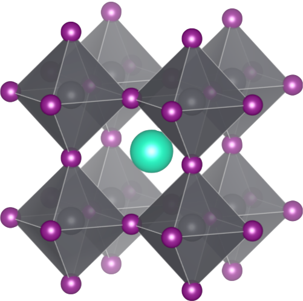
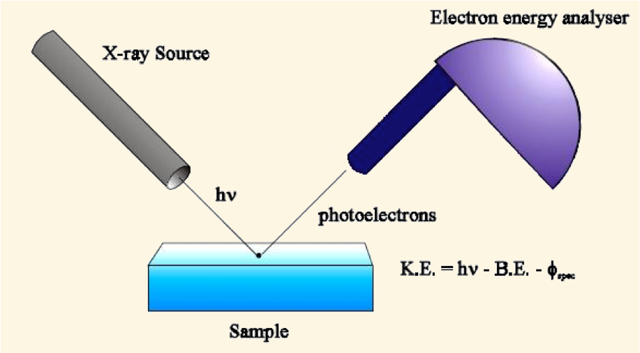
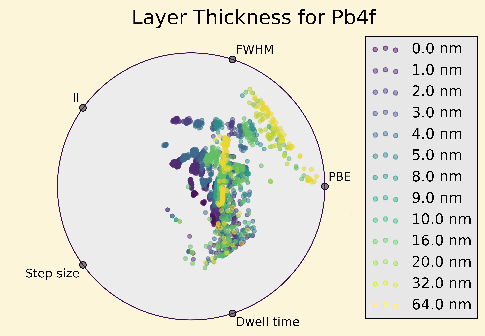
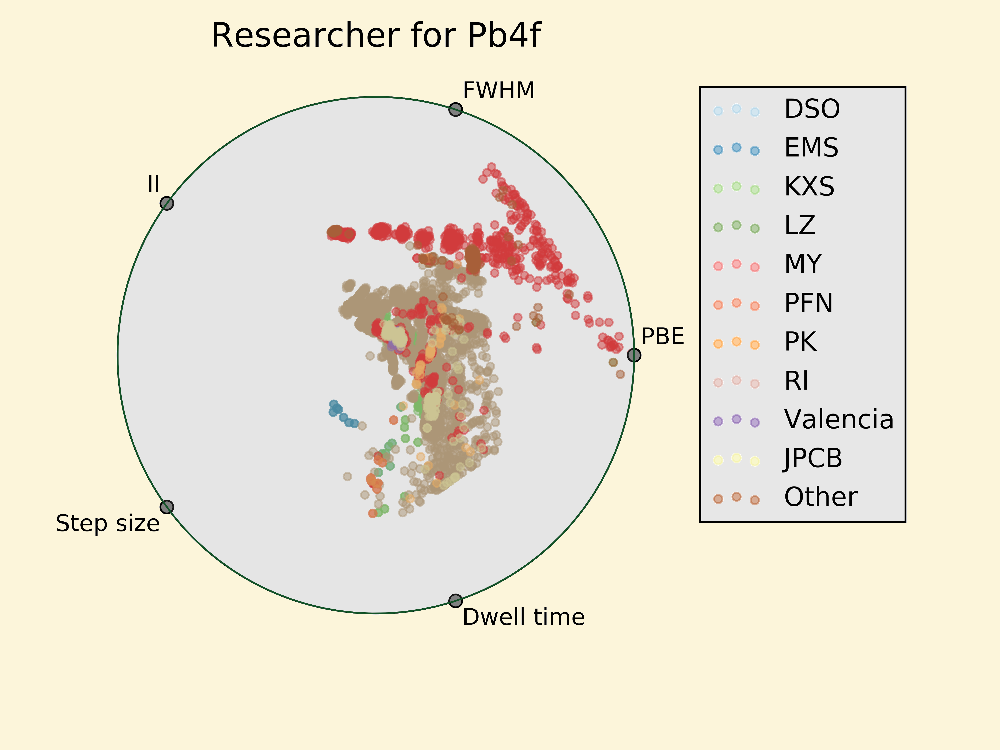
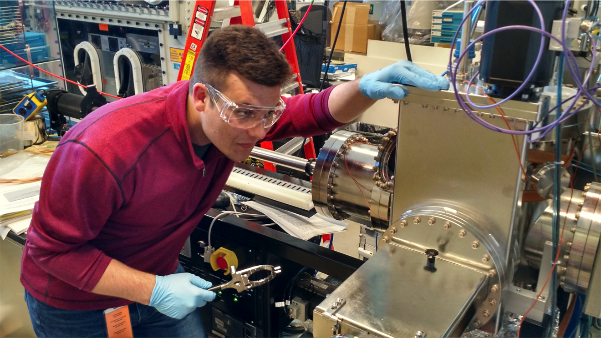
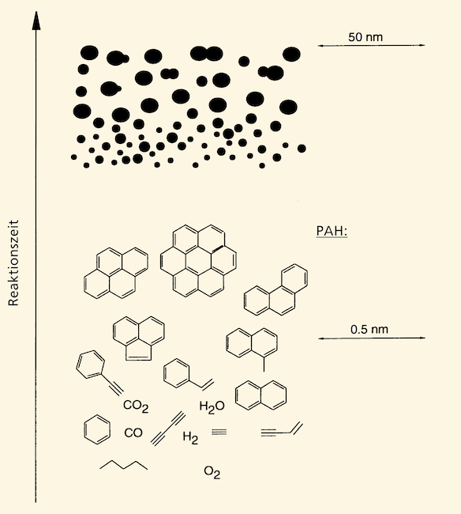
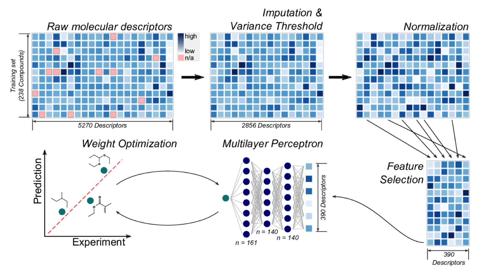
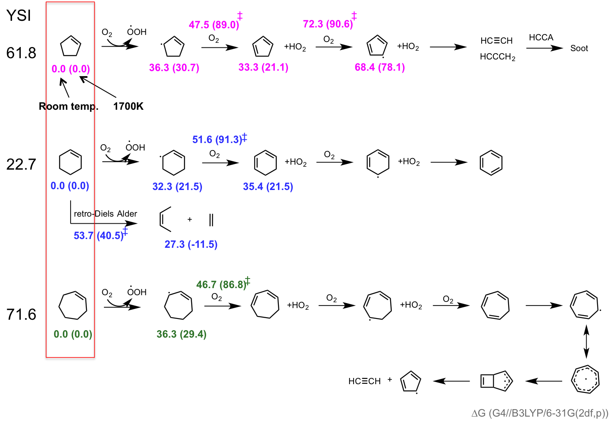

% NREL Internship Review
% Paul Kairys
% July 2017

# Personal Background 

## {#id .class style="background:none; border:none;box-shadow:none;"}

-  I was born and raised there
-  I went to school there
-  I am attempting to never go back there

## {#id .class style="background:none; border:none; box-shadow:none;"}

- B.Sc. Chemical Engineering
- Undergraduate research focused on finite element simulations and digital signal processing
- Programming in COMSOL(FEM software in Java), Matlab, Python, Julia
- Senior year I postponed graduation to come to NREL and do cool stuff

# Internship \#1 : SULI

## Halide perovskite Solar Cell Team

- Part of the MCST and Interfacial and Surface Sciences Group
- Mentors were Joe Berry (PI) and Philip Schulz (post-doc)
- Chosen because I was interested in materials and could use python
- Also chosen because they waited until the last minute

## Intro to Perovskite Solar Cells

- Efficient &#10004;
- Cheap to make &#10004;
- Even a little stable &#120403;  
- Consistent Properties &#120403;
- ABX~3~ structure
    -  A : MA, FA, Cs, Rb
    -  B : Pb, Sn
    -  X : I, Cl, Br

## ABX~3~ Cubic Crystal

{ width=80% height=80% #id .class style="background:none; border:none; box-shadow:none;"}

## How to get a better understanding of these materials?

## X-ray Photoemission Spectroscopy 

{ width=40% height=40% #id .class style="background:none; border:none; box-shadow:none;"}

## XPS:

-  Pros:
    -  Quantitative surface analysis technique 
    -  Probes core electrons 0-10 nm deep
    -  Provides information about electronic _and_ chemical environment at the surface
    -  Provides extremely useful info on charge transfer dynamics at the surface of a material

## XPS:

-  Cons:
    -  Typically slow (hrs for single core level scan)
    -  Subjective Analysis
    -  Perovskites tend to fall apart under normal sunlight (X-rays hurt)

## My Project

1. Enable high-throughput photoemission studies with high fidelity
    -  Requires automated analysis and quantified error

2. Build materials database and perform bulk analysis
    - Requires experimentalists to keep their files organized and/or consistent

## Results 

1. At high throughput, the electronic information provided by XPS is limited. But it works very well for chemical composition and material classification.

2. There are very clear trends to see when bulk analysis is performed.
    -  Only able to perform qualitative analysis due to time constraints 

## { width=50% height=50% #id .class style="background:none; border:none; box-shadow:none;"}

## { width=50% height=50% #id .class style="background:none; border:none; box-shadow:none;"}

## Bonus Picture

{ width=50% height=50% #id .class style="background:none; border:none; box-shadow:none;"}

# Internship \#2 : RPP

## Computational Modeling - Biomolecular Sciences

- Worked primarily with Yannick Bomble (PI#1), Seonah Kim (PI#2), and Peter St. John (post-doc)
- Research primarily focuses on computational biology and chemistry

## Project 1:
### Modeling/Predicting Soot Formation Chemistry

## Soot Background

-  Soot is a collection nano-scale particles made of polycyclic aromatic hydrocarbons
-  Soot formation exacerbated by the presence of specific precursors during combustion
-  Controlling soot formation is critical when designing new fuels from biomass
-  Metrics like the Yield Sooting Index (YSI) describe a molecule's propensity to create soot during combustion

## { width=50% height=50% #id .class style="background:none; border:none; box-shadow:none;"}

## How to predict which fuels make the most soot?

## Use statistical models!

-  An artificial neural net (ANN) takes an array of inputs to predict some number
    -  It is like fitting a curve, except in a very non-linear and high-dimensional space 
-  When used for chemistry/biology this is called a Quantitative Structure Activity Relationship (QSAR)
-  So what are the inputs? -->  _molecular descriptors_ 
    - Number of double bonds
    - Number of aromatic rings
    - ~5000 descriptors

## { width=50% height=50% #id .class style="background:none; border:none; box-shadow:none;"}

## Outliers

- Every statistical model has them
- Indicative that the outlier's chemistry/physics is not fully "caught" by the model
    -  Something interesting might be happening
- One particular outlier comes from the group of cycloalkenes

## { width=50% height=50% #id .class style="background:none; border:none; box-shadow:none;"}

## Results

-  A model that can accurately predict a molecule's propensity to create soot 
-  Chemical insights
-  A paper

## Project 2: 
### Cellulase Enzyme Dynamics and Characterization

## Enzyme Background

-  Cellulase Enzymes "eat" ... Cellulose
-  Understanding how their structure changes is critical to engineering and optimization of these macromolecules. 
-  One way to characterize these proteins is with Small Angle X-ray (or Neutron) Scattering

## Results + Conclusion

-  We had _really_ bad data --> No real results
-  I got to go to Brookhaven National Laboratory to run experiments at their synchrotron

# Questions/Comments?

